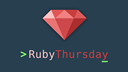
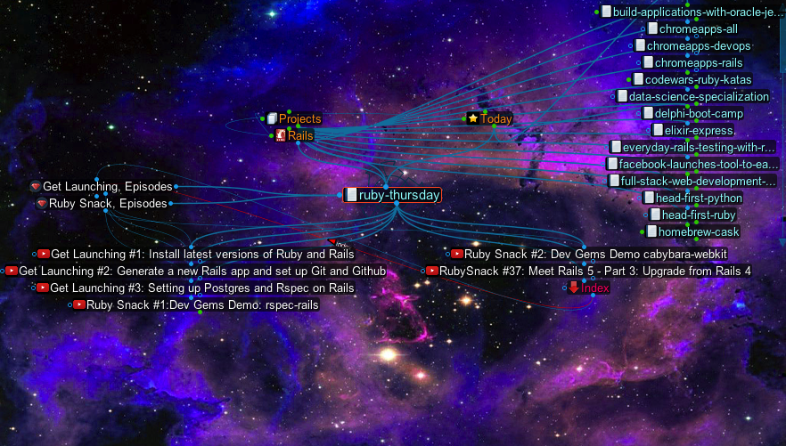

```
Roberto Nogueira  BSd EE, MSd CE
Solution Integrator Experienced - Certified by Ericsson
```

# RubyThursday



**About This Tutorial**

This Tutorial is a series of `Ruby Snacks` covered in order to learn deeper `Rails` related topics.



**Table of Contents**

```
Get Launching
[x] Get Launching #1: Install latest versions of Ruby and Rails
[x] Get Launching #2: Generate a new Rails app and set up Git and Github
[x] Get Launching #3: Setting up Postgres and Rspec on Rails

Ruby Snacks
[x] Ruby Snack #1:Dev Gems Demo: rspec-rails
[ ] Ruby Snack #2: Dev Gems Demo cabybara-webkit
:
```
